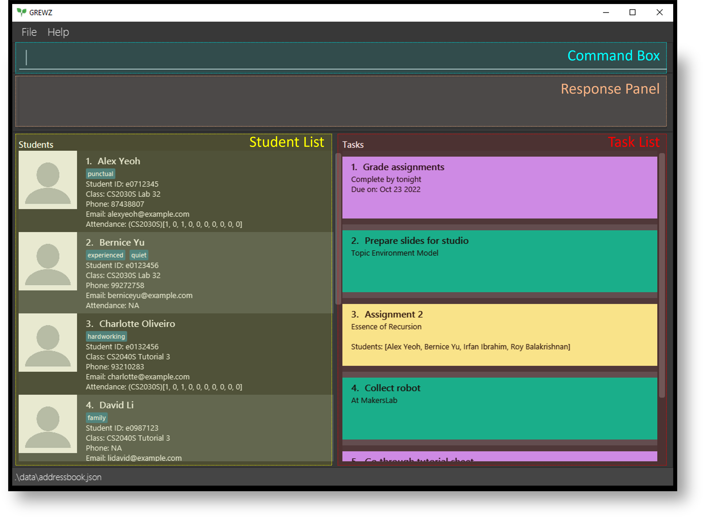
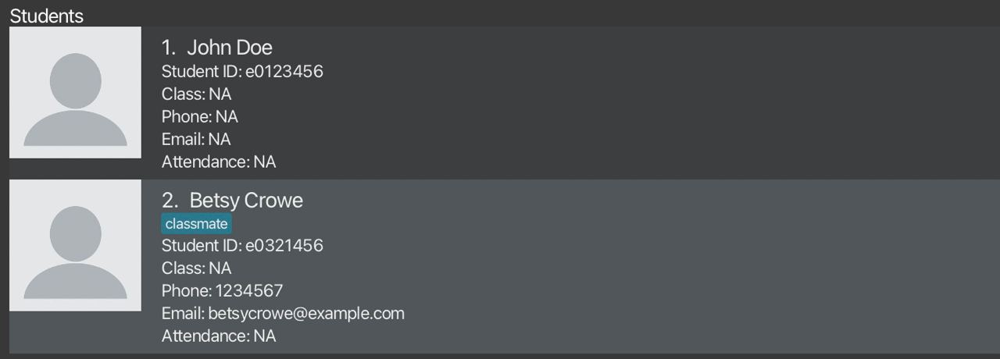
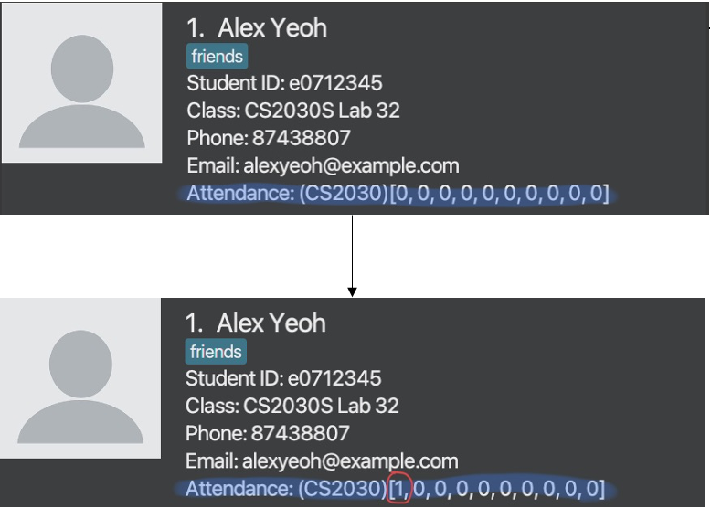
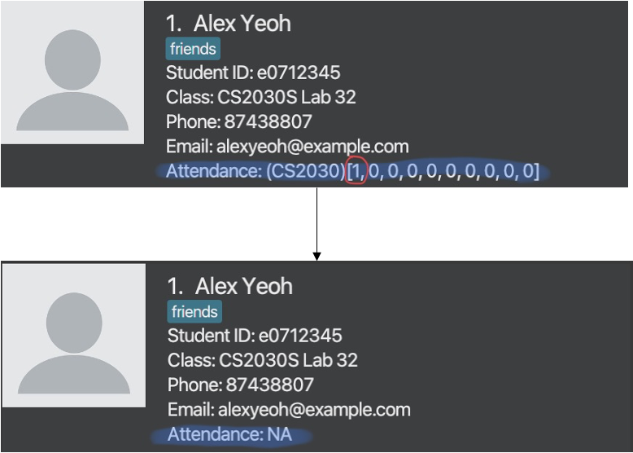
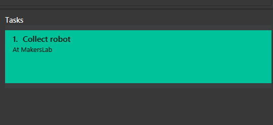
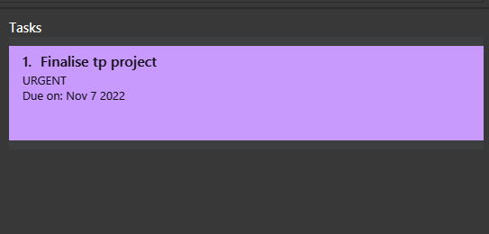
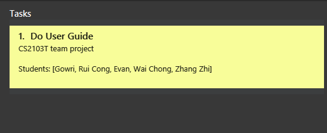

* Table of Contents
{:toc}

## 1. Introduction

### 1.1 About GREWZ
Tired of opening multiple applications for your teaching needs? Proficient in typing? Look no further!

GREWZ helps **university teaching assistants** to maintain the information of the students in their classes by collating 
a list of students' personal details, as well as keeping a task book to help them keep track of their personal work.

As a teaching assistant, you can use GREWZ as an all-in-one platform to carry out your teaching duties such as: 
* Marking attendance
* Updating student details
* Managing personal homework

GREWZ boasts a timeless, compartmentalised [Graphical User Interface (GUI)](#6-glossary) while utilising a clean 
[Command Line Interface (CLI)](#6-glossary) - this means that the faster you can type, the faster you can get your work done.

Hopefully our application has grown on you! 

### 1.2 Navigation
The aim of this User Guide is to provide you with all the information needed to fully utilise GREWZ. We understand the 
steep difficulty curve when learning Command Line Interface (CLI) programs and have tried our best to ease you in. 

If you need help setting up GREWZ, jump over to [Quick start](#2-quick-start) to continue.

For understanding more about GREWZ features and commands, head over to [Features](#3-features).

To have a look at frequently asked question, refer to [FAQs](#4-faq)

If you want the quick overview of GREWZ commands, jump over to [Command Summary](#5-command-summary)

Take note of the following symbols and formatting used in this document:

| Symbol               | Meaning                                               |
|----------------------|-------------------------------------------------------|
| :information_source: | Provides notes for the user                           |
| :exclamation:        | Possible errors that might come from user interaction |
| :bulb:               | Provides additional information about the feature     |

--------------------------------------------------------------------------------------------------------------------

## 2. Quick start

### 2.1 Installation

1. Ensure you have Java `11` or above installed in your Computer. For more details, check out the [FAQs](#4-faq).

2. Download the latest `GREWZ.jar` from [here](https://github.com/AY2223S1-CS2103T-W12-4/tp/releases).

3. Copy the file to the folder you want to use as the [_home folder_](#6-glossary) for your GREWZ.

4. Double-click the file to start the app. The GUI similar to the one below should appear in a few seconds. Note how the app contains some sample data.<br>
   


### 2.2 First Use
Type the command in the command box and press Enter to execute it. e.g. typing **`help`** and pressing Enter will open the help window.<br>
Some example commands you can try:

   * **`list`** : Lists all students.

   * **`add`**`n/John Doe i/e0778123` : Adds a student named `John Doe` with student ID `e0778123` to the student list.

   * **`delete`**`3` : Deletes the 3rd student shown in the current list.

   * **`clear`** : Deletes all students.

   * **`exit`** : Exits the app.

Refer to the [Features](#3-features) below for details of each command.

--------------------------------------------------------------------------------------------------------------------

## 3. Features
[Back to Top ↑](#1-introduction)

<div markdown="block" class="alert alert-info">

**:information_source: Notes about the command format:**<br>

* Words in `UPPER_CASE` are the [parameters](#6-glossary) to be supplied by the user.<br>
  e.g. in `add n/NAME`, `NAME` is a parameter which can be used as `add n/John Doe`.

* Items in square brackets are optional.<br>
  e.g `n/NAME [t/TAG]` can be used as `n/John Doe t/friend` or as `n/John Doe`.

* Items with `…`​ after them can be used multiple times including zero times.<br>
  e.g. `[t/TAG]…​` can be used as ` ` (i.e. 0 times), `t/friend`, `t/friend t/family` etc.

* Parameters can be in any order.<br>
  e.g. if the command specifies `n/NAME p/PHONE_NUMBER`, `p/PHONE_NUMBER n/NAME` is also acceptable.

* If a parameter is expected only once in the command but you specified it multiple times, only the last occurrence of the parameter will be taken.<br>
  e.g. if you specify `p/12341234 p/56785678`, only `p/56785678` will be taken.

* [Extraneous](#6-glossary) parameters for commands that do not take in parameters (such as `help`, `list`, `exit` and `clear`) will be ignored.<br>
  e.g. if the command specifies `help 123`, it will be interpreted as `help`.

</div>

### 3.1 Student Features
[Back to Top ↑](#1-introduction)

The student features will assist you in managing student details with ease. 

#### 3.1.1 Adding a student: `add`

Adds a student to the class list.

Format: `add n/NAME i/STUDENT_ID [p/PHONE_NUMBER] [e/EMAIL] [c/CLASS_GROUP] [t/TAG]…​`


* Fields in square bracket`[]` are optional.
* The fields can be written in any order.
* ***Only*** Name and Student ID are compulsory to fill in.
* Name must only consist of alphanumeric characters and spaces, as well as special characters such as `, ' .`.
* Student ID must take the format of e0XXXXXX where X is a digit from 0 to 9.
* A student can have any number of tags (including 0).

<div markdown="span" class="alert alert-warning">:information_source: **Note:**
Students CANNOT have the same name.

GREWZ naming convention is [case-insensitive](#6-glossary), but [whitespace-sensitive](#6-glossary).
This means that it does not allow for students with the exact same name to be keyed into the application. 
Thus trying to add a student with the name `Ben` and `ben` will not work.
Student ID must also be unique.
</div>

<div markdown="span" class="alert alert-primary">:bulb: **Additional information:**
If you have two students with the same name, you can swap the order of the student's first and last name.
</div>

Examples:
* `add n/John Doe i/e0123456`
* `add n/Betsy Crowe i/e0321456 e/betsycrowe@example.com p/1234567 t/classmate`

Below is an example of how the UI will look like after executing this two commands:
  

#### 3.1.2 Listing all students : `list`

Shows a list of all students in the student list.

Format: `list`

#### 3.1.3 Adding a class field to a student: `class`

Add the class group to the specified student from the student list.

Format: `class 1 c/CLASS`

* Edits the student at the specified INDEX. The index refers to the index number shown in the displayed student list. The index must be a positive integer 1, 2, 3, …
* Existing class group will be updated to the input values.
* You can remove a student's class group by typing `c/` without specifying any value after it.

Examples:
* ```class 1 c/CS2030S Lab 32``` Edits the class group of the 1st student in the list to be CS2030S Lab 32.
* ```class 1 c/ ``` Clears the class group of the 1st student in the list.

#### 3.1.4 Uploading/Changing student profile picture: `upload-pic`

GREWZ allows you to upload image of your students into your application. The following steps will help you upload photos of your students into the student list.

Format: `upload-pic INDEX`

* Uploads a picture for the student at the specified `INDEX`. The index refers to the index number shown in the displayed student list. The index **must be a positive integer** 1, 2, 3, …​
* A window will open to allow you to select a file from your computer. The file **must** be of [.JPG](#6-glossary) format.
* If no picture exists for the student specified, the selected picture will be assigned to the student.
* Existing picture will be updated to the input file picture.

<div markdown="span" class="alert alert-warning">:information_source: **Note:**
You are recommended to select an image of dimensions ratio of about 1:1 otherwise the selected picture may not appear nicely.
</div>

#### 3.1.5 Editing student information : `edit`

Edits an existing student in the student list.

Format: `edit INDEX [n/NAME] [p/PHONE] [e/EMAIL] [c/CLASS] [i/STUDENT_ID] [t/TAG]…​`

* Edits the student at the specified `INDEX`. The index refers to the index number shown in the displayed student list. The index **must be a positive integer** 1, 2, 3, …​
* At least one of the optional fields must be provided.
* Existing values will be updated to the input values.
* You can clear the value in a field by typing its [prefix](#6-glossary) without specifying any value after it.
* When editing tags, the existing tags of the student will be removed i.e adding of tags is not cumulative.
* You can remove all the student’s tags by typing `t/` without
    specifying any tags after it.
* This command does not offer editing a student's profile picture. To do this, refer to [upload](#314-uploadingchanging-student-profile-picture-upload-pic).

Examples:
* `edit 1 p/91234567 e/studentEmail@example.com` Edits the phone number and email of the 1st student in the list to be `91234567` and `studentEmail@example.com` respectively.
* `edit 2 n/Jackie Chan t/` Edits the name of the 2nd student to be `Jackie Chan` and clears all existing tags.
* `edit 3 p/ e/ c/` Clears the stored phone number, email and class of the 3rd student in the list.

#### 3.1.6 Locating students: `find`

Finds students whose student details contain any of the given keywords.

Format: `find KEYWORD [MORE_KEYWORDS]...`

* The search is case-insensitive. e.g hans will match Hans
* The order of the keywords does not matter. e.g. Hans Bo will match Bo Hans
* All fields are searched - `NAME`, `STUDENT_ID`, `PHONE`, `CLASS`, `EMAIL`.
* Partial words will also be matched e.g. Han will match Hans
* Students matching at least one keyword will be returned (i.e. OR search).
  e.g. `find Hans Bo` will return `Hans Gruber`, `Bo Yang`

Examples:
* `find Jack` returns `jack tan` and `Jack Lee`
* `find alex dav` returns `Wong Alex, David Lim`


#### 3.1.7 Deleting a student : `delete`

Deletes the specified student from the student list.

Format: `delete INDEX`

* Deletes the student at the specified `INDEX`.
* The index refers to the index number shown in the displayed student list.
* The index **must be a positive integer** 1, 2, 3, …​

Examples:
* `list` followed by `delete 2` deletes the 2nd student in the student list.
* `find Betsy` followed by `delete 1` deletes the 1st student in the results of the `find` command.

#### 3.1.8 Attendance management

We developed a feature to add an attendance list of a maximum of 12 lessons to help you record attendance for your students. 
You can mark/unmark attendance of your students. 
Currently, we only support one attendance list per student.

##### Adding an attendance list to a student: `attendance add`

Adds an attendance list to a student in contacts. 

Format: `attendance add INDEX c/CLASS s/ATTENDANCE_SIZE`

Examples:
* `attendance add 1 c/CS2030 s/10` creates an attendance list of size 10 with a class name `CS2030` for the 1st student in the shown student list.
* `attendance add 1 c/CS2040 s/1` creates an attendance list of size 1  with a class name `CS2040` for the 1st student in the shown student list.

<div markdown="span" class="alert alert-primary">:bulb: **Additional information:**
Currently, we support a maximum of 12 lessons. If the size of the attendance list keyed in is 0, the attendance list will be listed as N.A. 
There can only be a maximum of one attendance list for each student for ease of typing.
</div>

<div markdown="span" class="alert alert-warning">:exclamation: **Caution:**
Be careful when adding attendance to a student as adding an attendance list to a student with a pre-existing attendance list will overwrite the current attendance list of the student.
</div>

Expected outcome:

After using ```attendance add``` command

##### Marking attendance of student: `attendance mark`

Marks attendance of given student in class list. In this case, we use 0 for absent and 1 for present.

Format: `attendance mark INDEX l/LESSON m/ATTENDANCE_VALUE`

<div markdown="span" class="alert alert-primary">:bulb: **Additional information:**
The first lesson starts from index 1. GREWZ only accepts 0 and 1 for attendance values which correspond to absent and present respectively.
We adopted such an approach as it is faster for you to type numerical values over full words.
</div>

Examples:
* `attendance mark 1 l/1 m/1` marks the attendance of the 1st lesson for the 1st student in the shown student list with a 1.
* `attendance mark 1 l/2 m/0` marks the attendance of the 2nd lesson for the 1st student in the shown student list with a 0.

Expected outcome:



After using ```attendance mark``` command

##### Deleting attendance list of a student: `attendance delete`

Deletes the entire attendance list of a student in the student list.

Format: `attendance delete INDEX`

Examples:
* `attendance delete 1` deletes the attendance list for the 1st student in the shown student list.
* `attendance delete 2` deletes the attendance list for the 2nd student in the shown student list.

Expected outcome:<br>
<br>
After using ```attendance delete``` command

### 3.2 Task Features
[Back to Top ↑](#1-introduction)

The task feature helps you to keep track of your ToDos, Deadlines and Assignment submission.

#### 3.2.1 Adding a Task : `task`

Adds a task to the Task List.
There is three different types of Task - ***ToDo***, ***Deadline*** and ***Assignment***.

<div markdown="span" class="alert alert-primary">:bulb: **Additional information:**
Tasks can be duplicated, so it is possible to have multiple same tasks.
</div>

##### Adding a ToDo

Adds a ***ToDo*** (A type of Task) to the Task List.

Format: `task t/TITLE d/DESC`

* A ToDo Task should always include a title and description and should not be left blank.
* Both title and description should not be left blank.

Examples:
* `task t/Prepare studio slides d/Topic Environment Model` adds a ToDo Task with title `Prepare studio slides` and description `Topic Environment Model` to the task list.
* `task t/Collect robot d/At MakersLab` adds a ToDo Task with title `Collect robot` and description `At MakersLab` to the task list.

Expected outcome:<br>
<br>
After adding a ToDo task

##### Adding a Deadline

Adds a ***Deadline*** (A type of Task) to the Task List.

Format: `task t/TITLE d/DESC by/YYYY-MM-DD`

* A Deadline Task should always include a title, description and date and should not be left blank.
* The `by/` prefix **MUST** be present for the task to be a deadline.
* Both title and description should not be left blank.
* A date should strictly follow the format of YYYY-MM-DD and it should be a valid date.

<div markdown="span" class="alert alert-primary">:bulb: **Additional information:**
Only dates you can find on a calendar are valid dates. 0000-00-00 is <strong>not</strong> considered a valid date.
</div>

Examples:
* `task t/Prepare studio slides d/Topic Lists by/2020-12-12` adds a Deadline Task with title `Prepare studio slides`, description `Topic Lists` and date `12 Dec 2020` to the task list.
* `task t/Collect robot d/At MakersLab by/2019-09-10` adds a Deadline Task with title `Collect robot`, description `At MakersLab` and date `10 Sep 2019` to the task list.

Expected outcome: <br>
 <br>
After adding a Deadline task

##### Adding an Assignment

Adds an ***Assignment*** (A type of Task) to the Task List.

Format: `task t/TITLE d/DESCRIPTION addStu/STUDENT_1, STUDENT_2 ...`

* An Assignment Task should always include a title, description that should not be left blank.
* The `addStu/` prefix **MUST** be present for the task to be an assignment.
* The number of students input is zero or more, and each student is separated by a `,` comma, thus student names should not contain commas.
* Both title and description should not be left blank.

Examples:
* `task t/Assignment 1 d/Midterm addStu/Adam Tan, Wong Zhu Yi` adds an Assignment Task with title `Assignment 1`, description `Midterm` and two students `Adam Tan`, `Wong Zhu Yi`, to the task list.
* `task t/Mock PE d/Simulates actual PE addStu/Alvin, Simon, Theodore` adds an Assignment Task with title `Mock PE`, description `Simulates actual PE` and three students `Alvin`, `Simon`, `Theodore`, to the task list.

<div markdown="span" class="alert alert-primary">:bulb: **Additional information:**
Currently, we allow Assignment tasks to take in any student name, even if they do not exist in the Student list yet.
However, we will link the students to the Assignments in future versions of GREWZ such that only students in the Student list can be added.
</div>

Expected outcome: <br>
 <br>
After adding an Assignment task

#### 3.2.2 Editing a Task : `edit-task`

Edits an existing tasks in the task list.

Format: `edit-task INDEX [t/TITLE] [d/DESCRIPTION] [by/YYYY-MM-DD] [addStu/STUDENT_1, STUDENT_2] [deleteStu/STUDENT_1, STUDENT_2]`

* Edits the task at the specified `INDEX`. The index refers to the index number shown in the displayed task list. The index **must be a positive integer** 1, 2, 3, …​
* At least one of the optional fields must be provided.
* For task specific fields `by/`, `addStu/`, and `deleteStu/`, can only be edited if the task is of the correct type.
    * `by/` is only accepted while editing a Deadline Task. A date should strictly follow the format of YYYY-MM-DD.
    * `addStu/` and `deleteStu/` are only accepted while editing an Assignment Task.
    * `addStu/` adds the student names to the assignment while `deleteStu/` deletes students names if the exact name is already in the assignment task's student list.
    * `deleteStu/` is case-sensitive so `deleteStu/adam yeoh` will **NOT** delete `Adam Yeoh` in the assignment's student list.
* Existing values will be updated to the input values.

Examples:
* `edit-task 1 t/Assignment 1 d/Topics: Recursion addStu/Adam Lee, Ben Tang`
  Edits the title, description and adds to student list of the 1st task in the task list, provided that it is an assignment task, to be `Assignment 1`, `Topics: Recursion` and adds `Adam Lee, Ben Tang` respectively.
* `edit-task 2 deleteStu/Jackie Chan` Edits the student list of the 2nd task in the task list to delete the name `Jackie Chan`. All other students in the student list of the task are not affected.

#### 3.2.3 Removing a Task : `remove-task`

Removes a specified task from the Task List (Can be a ToDo, Deadline or Assignment).

Format: `remove-task INDEX`

* Deletes the task at the specified `INDEX`.
* The index refers to the index number shown in the displayed task list.
* The index **must be a positive integer** 1, 2, 3, …​

Examples:
* `remove-task 2` removes the 2nd task in the task list.
* `remove-task 1` removes the 1st task in the task list.

### 3.3 General Features
[Back to Top ↑](#1-introduction)

#### 3.3.1 Clearing all entries : `clear`

Clears all entries from the student list as well as task list.

Format: `clear`

#### 3.3.2 Navigating User Input History: `↑`, `↓`

Allows user to quickly retrieve their previous inputs from current session by using the up and down arrow keys of your keyboard.

Format: `↑`, `↓`

#### 3.3.3 Saving the data

GREWZ data are saved in the hard disk automatically after any command that changes the data. There is no need to save manually.

#### 3.3.4 Editing the data file

GREWZ data are saved as a [JSON](#6-glossary) file `[JAR file location]/data/addressbook.json`. Advanced users are welcome to update data directly by editing that data file.

<div markdown="span" class="alert alert-warning">:exclamation: **Caution:**
If your changes to the data file makes its format invalid, GREWZ will discard all data and start with an empty data file at the next run.
</div>

#### 3.3.5 Viewing help : `help`

Shows a message explaining how to access the help page.


Format: `help`

#### 3.3.6 Exiting the program : `exit`

Exits the program.

Format: `exit`

--------------------------------------------------------------------------------------------------------------------

## 4. FAQ
[Back to Top ↑](#1-introduction)

**Q:** I don't know if I have [Java `11`](#6-glossary) installed in my computer. What do I do?
<br />
**A:** To check your Java version, open a Command Prompt or Terminal window on your computer and type:
```
java -version
```
This will show you the exact version of Java installed on your computer, if any.
If you do not have Java `11` installed, you can download it [here](https://www.oracle.com/java/technologies/downloads/#java11).
If you are still lost, try referring to [this site](https://blog.hubspot.com/website/check-java-verison).

**Q:** Do I have to retype the command every single time even if they are similar?
<br />
**A:** You can use our [input history feature](#332-navigating-user-input-history--) and simply use the UP `↑` and DOWN `↓` arrow keys to  access your older commands.

**Q:** What is the difference between the different types of [tasks](#32-task-features)?
<br />
**A:** All the three tasks essentially have a task title and description. What differentiates them is that a deadline task has date property where you can set its deadline and an assignment task has a student property where you can add a list of student who are yet to complete the assignment task. Lastly, the todo task has neither of these fields.

**Q:** How do I add a student if I do not have their student ID?
<br />
**A:** Unfortunately we need the name and student ID of the student minimally as we are using this fields to distinguish
the students in the student list. However, you could initially add a dummy student ID and tag the student profile as "incomplete".

**Q:** How do I add a deadline to an existing ToDo task?
<br />
**A:** Remove the existing ToDo task, then add the same task with your given deadline.

**Q:** How do I edit an existing task?
<br />
**A:** Use our [edit task](#322-editing-a-task--edit-task) feature to edit the respective fields.


**Q:** How do I transfer my data into another computer?
<br />
**A:** Download the app in the other computer and transfer all files from the images and data folders from the existing computer into the new images and data folders in the new computer.

**Q:** How do I use the [attendance commands](#318-attendance-management)?
<br />
**A:** Initially, each student has no attendance list. You should add an attendance list and mark different lessons that the student attends or unmark them if they are not present. At the end of the semester, you can delete the attendance list when not needed.

--------------------------------------------------------------------------------------------------------------------

## 5. Command summary
[Back to Top ↑](#1-introduction)

### 5.1 Student Management Commands

| Action                                                                            | Format                                                                                   | Examples                                                                          |
|-----------------------------------------------------------------------------------|------------------------------------------------------------------------------------------|-----------------------------------------------------------------------------------|
| **[Add Student](#311-adding-a-student-add)**                                      | `add n/NAME  i/STUDENT_ID [t/TAG] [e/EMAIL] [p/PHONE_NUMBER] [c/CLASS]…​`                | `add n/James Ho i/e0823115 p/22224444 e/jamesho@example.com t/friend t/colleague` |
| **[List Students](#312-listing-all-students--list)**                              | `list`                                                                                   |                                                                                   |
| **[Add Class](#313-adding-a-class-field-to-a-student-class)**                     | `class`                                                                                  | `class 1 c/CS2030S Lab 32`                                                        |
| **[Upload Picture](#314-uploadingchanging-student-profile-picture-upload-pic)**   | `upload-pic INDEX`                                                                       | `upload-pic 1`                                                                    |
| **[Edit Student](#315-editing-student-information--edit)**                        | `edit INDEX [n/NAME] [i/STUDENT_ID] [p/PHONE_NUMBER] [e/EMAIL] [i/STUDENT_ID] [t/TAG]…​` | `edit 2 n/James Lee e/jameslee@example.com`                                       |
| **[Find Student](#316-locating-students-find)**                                   | `find KEYWORD [MORE_KEYWORDS]...`                                                        | `find James Jake`                                                                 |
| **[Delete Student](#317-deleting-a-student--delete)**                             | `delete INDEX`                                                                           | `delete 3`                                                                        |
| **[Add Attendance](#adding-an-attendance-list-to-a-student-attendance-add)**      | `attendance add INDEX c/CLASS s/ATTENDANCE_SIZE`                                         | `attendance add 1 c/CS2030 s/10`                                                  |
| **[Delete Attendance](#deleting-attendance-list-of-a-student-attendance-delete)** | `attendance delete INDEX`                                                                | `attendance delete 1`                                                             |
| **[Mark Attendance](#marking-attendance-of-student-attendance-mark)**             | `attendance mark INDEX l/LESSON m/ATTENDANCE_VALUE`                                      | `attendance mark 1 l/1 m/1`                                                       |

### 5.2 Task Management Commands

| Action                                               | Format                                                                                                                  | Examples                                                                   |
|------------------------------------------------------|-------------------------------------------------------------------------------------------------------------------------|----------------------------------------------------------------------------|
| **[Add Todo Task](#adding-a-todo)**                  | `task t/TITLE d/DESC`                                                                                                   | `task t/Work on essay d/GE module`                                         |
| **[Add Deadline Task](#adding-a-deadline)**          | `task t/TITLE d/DESC by/YYYY-MM-DD`                                                                                     | `task t/Prepare slides for studio d/Topic Environment Model by/2020-12-12` | 
| **[Add Assignment Task](#adding-an-assignment)**     | `task t/TITLE d/DESC addStu/STUDENT_1,STUDENT_2...`                                                                     | `task t/Assignment 3 d/Topic Environment Model addStu/Adam, Ben`           |
| **[Edit Task](#322-editing-a-task--edit-task)**      | `edit-task INDEX [t/TITLE] [d/DESC] [by/YYYY-MM-DD] [addStu/STUDENT_1,STUDENT_2...] [deleteStu/STUDENT_1,STUDENT_2...]` | `edit-task 1 t/Mark Lab Worksheets d/CS2030S by/2022-10-30`                | 
| **[Remove Task](#323-removing-a-task--remove-task)** | `remove-task INDEX`                                                                                                     | `remove-task 1`                                                            |

### 5.3 General Commands

| Action                       | Format   |
|------------------------------|----------|
| **Clear**                    | `clear`  |
| **Navigating Input History** | `↑`, `↓` |
| **Help**                     | `help`   |
| **Exit**                     | `exit`   |

--------------------------------------------------------------------------------------------------------------------

## 6. Glossary
[Back to Top ↑](#1-introduction)

| Word                                       | Definition                                                                                                                                     |
|--------------------------------------------|------------------------------------------------------------------------------------------------------------------------------------------------|
| **Command Line Interface (CLI)**           | A command-line interface (CLI) is a text-based user interface (UI) used to run programs, manage computer files and interact with the computer. |
| **Graphical user interface (GUI)**         | Graphical user interface (GUI) is a form of user interface that allows users to interact with electronic devices through graphical icons.      |
| **Home Folder**                            | A folder on your computer that stores all data related to this application.                                                                    |
| **Parameter**                              | Parameter is the user's input for particular field.                                                                                            |
| **Prefix**                                 | A group of characters placed before the input value. GREWZ uses prefixes like `n/`, `t/` and `p/`.                                             |
| **Teaching assistant**                     | Teaching assistant is an individual who assists a professor with instructional responsibilities.                                               |
| **JavaScript Object Notation (JSON)**      | JavaScript Object Notation (JSON) is used for storing and transferring data.                                                                   |
| **Joint Photographic Experts Group (JPG)** | Joint Photographic Experts Group (JPG) is an image file type and used for compression of digital images.                                       |
| **User input history**                     | User input history is the previous inputs the user has keyed in.                                                                               |
| **Task**                                   | Task is a piece of work to be done and the category Todo, Deadline and Assignment is under.                                                    |
| **Todo**                                   | Todo is a task with a title and description.                                                                                                   |
| **Deadline**                               | Deadline is a task with a title, description and due date.                                                                                     |
| **Assignment**                             | Assignment is a task with title, description and a list of students that needs to finish the task.                                             |
| **Attendance List**                        | Attendance list is a record of the student's attendance for his class.                                                                         |
| **Case-sensitive**                         | Case-sensitive is the ability to differentiate between capital and lower case letters                                                          |
| **Space-insensitive**                      | Space-insensitive is the lack of ability to differentiate between blank spaces in words.                                                       |
| **Extraneous**                             | Irrelevant or unrelated to the subject being dealt with.                                                                                       |
| **Java**                                   | Widely used programming language and it is a software platform used in distributed environment of the internet.                                |

[Back to Top ↑](#1-introduction)
